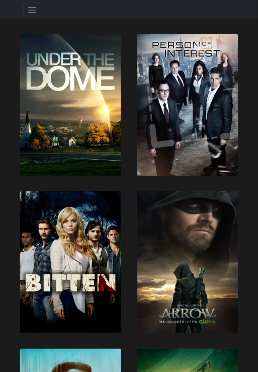
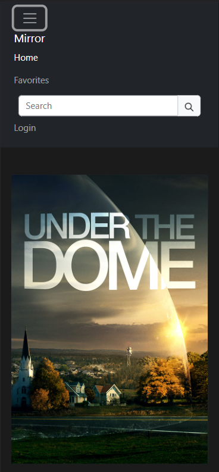
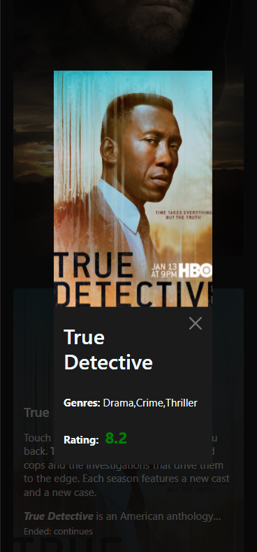

<h1 align="center">Mirror</h1>
<h3 align="center">Service for serials</h3>

<p align="center">

</p>


## Description

&nbsp;&nbsp;&nbsp;&nbsp;This project was made in the process of learning front-end development. It allows you to display a list of series using the public TVMaze API. This service allows you to find out detailed information about each of the series and TV shows: release year, genres, description, rating, etc. The most liked pictures can be added to favorites. Then their entire list can be viewed on a separate Favorites page. In addition, a keyword search is implemented.

<p align="center">
</p>

##

<p align="center">

</p>

## About the project

&nbsp;&nbsp;&nbsp;&nbsp;Since it was decided to implement the favorites on a separate page, there was a need for a variable (an array with the id of the liked pictures), which would save the values when the page was updated. For this I used the object localStorage. As a solution without the use of backend tools, it is great. And since this project is aimed at studying exactly the part of front-end development, this is quite a suitable solution.

```javascript
let favorites = JSON.parse(localStorage.favArray); //// array with the id of the liked pictures

const checkbox = document.querySelector(".favorites"); //// Add to favorites
checkbox.addEventListener("click", () => {
  if (favorites.includes(String(checkbox.id))) {
    checkbox.classList.remove("favorites-true");
    favorites = favorites.filter((item) => item != checkbox.id);
  } else {
    checkbox.classList.add("favorites-true");
    favorites.push(checkbox.id);
  }
  // console.log(favorites);
  localStorage.favArray = JSON.stringify(favorites);
});
```

##

&nbsp;&nbsp;&nbsp;&nbsp;The service is fully responsive for devices with any screen size. For this, the following Bootstrap classes were used:
```html
<div class="row row-cols-1 row-cols-md-2 row-cols-lg-4 g-5">...</div>
```
In addition, i used media queries in CSS. For example:
```css
@media screen and (min-width: 426px) and (max-width: 820px) {
  .card-img-top {
    height: 450px;
  }

  .moduleWin {
    display: block;
    height: 800px;
  }

  .img-module {
    display: block;
    margin: auto;
    height: 500px;
  }
}
```

<p align="center">

&nbsp;&nbsp;&nbsp;&nbsp;&nbsp;
&nbsp;&nbsp;&nbsp;&nbsp;&nbsp;
</p>

##

&nbsp;&nbsp;&nbsp;&nbsp;When you hover over the cover of the series, a part of its description appears. By clicking on the picture, a modal window will appear with all the details. If you need to find a specific TV show, you can use the search bar. The search is carried out by keywords. Below is the API download function:

```javascript
const getData = async (url) => {
  try {
    const response = await fetch(url);
    const api = await response.json();
    // console.log(api);

    if (Array.isArray(api)) {
      //// Passing an API array (after a search query)
      document.querySelector(".row").innerHTML = ""; //// Refresh page, erasing previous output
      api.forEach((element) => {
        showCard(element.show);
      });
    } else {
      showCard(api); //// Passing an API on initial load
      // console.log(card);
    }
  } catch (error) {
    console.log(error.message);
  }
};
```

Due to differences in the results of API requests for the name of the series and just the general list during initial loading, different data transfer to the card rendering function was implemented. When querying by keyword, an array is returned, and when rendering the initial page, a separate object for each series is returned, since this API does not have the ability to return all available TV shows at once.
