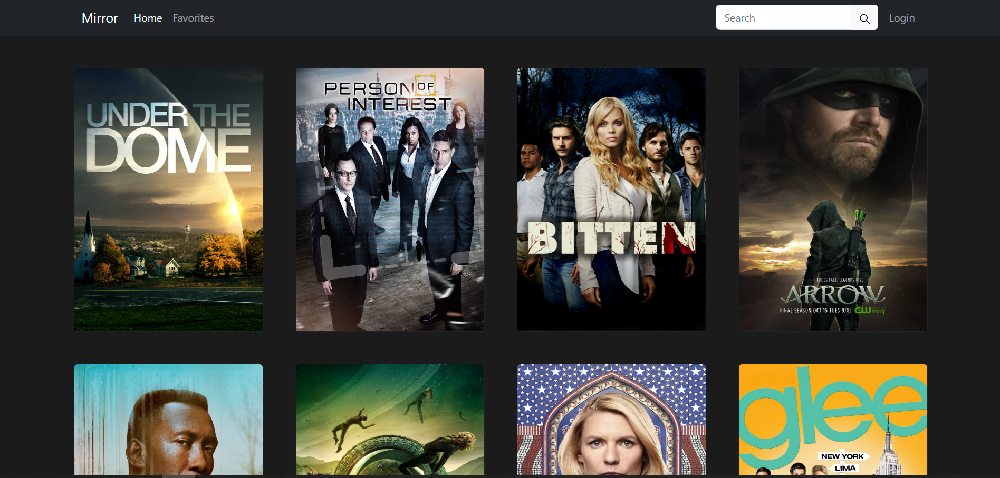
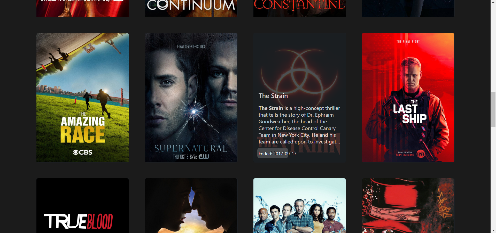
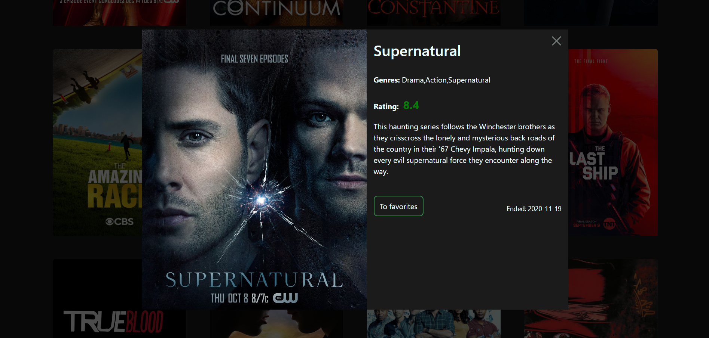

<h1 align="center">Mirror</h1>
<h3 align="center">Service for serials</h3>

<p align="center">

</p>


## Description

&nbsp;&nbsp;&nbsp;&nbsp;This project was made in the process of learning front-end development. It allows you to display a list of series using the public TVMaze API. This service allows you to find out detailed information about each of the series and TV shows: release year, genres, description, rating, etc. In addition, a keyword search is implemented.
&nbsp;&nbsp;&nbsp;&nbsp;In the future, it is planned to introduce the possibility of adding the series you like to favorites and authorization in your personal account.

<p align="center">
</p>

##

<p align="center">

</p>

## About the project

&nbsp;&nbsp;&nbsp;&nbsp;When you hover over the cover of the series, a part of its description appears. By clicking on the picture, a modal window will appear with all the details. If you need to find a specific TV show, you can use the search bar. The search is carried out by keywords. Below is the API download function:

```javascript
const getData = async (url) => {
  try {
    const response = await fetch(url);
    const api = await response.json();
    // console.log(api);

    if (Array.isArray(api)) {
      //// Passing an API array (after a search query)
      document.querySelector(".row").innerHTML = ""; //// Refresh page, erasing previous output
      api.forEach((element) => {
        showCard(element.show);
      });
    } else {
      showCard(api); //// Passing an API on initial load
      // console.log(card);
    }
  } catch (error) {
    console.log(error.message);
  }
};
```

Due to differences in the results of API requests for the name of the series and just the general list during initial loading, different data transfer to the card rendering function was implemented. When querying by keyword, an array is returned, and when rendering the initial page, a separate object for each series is returned, since this API does not have the ability to return all available TV shows at once.
